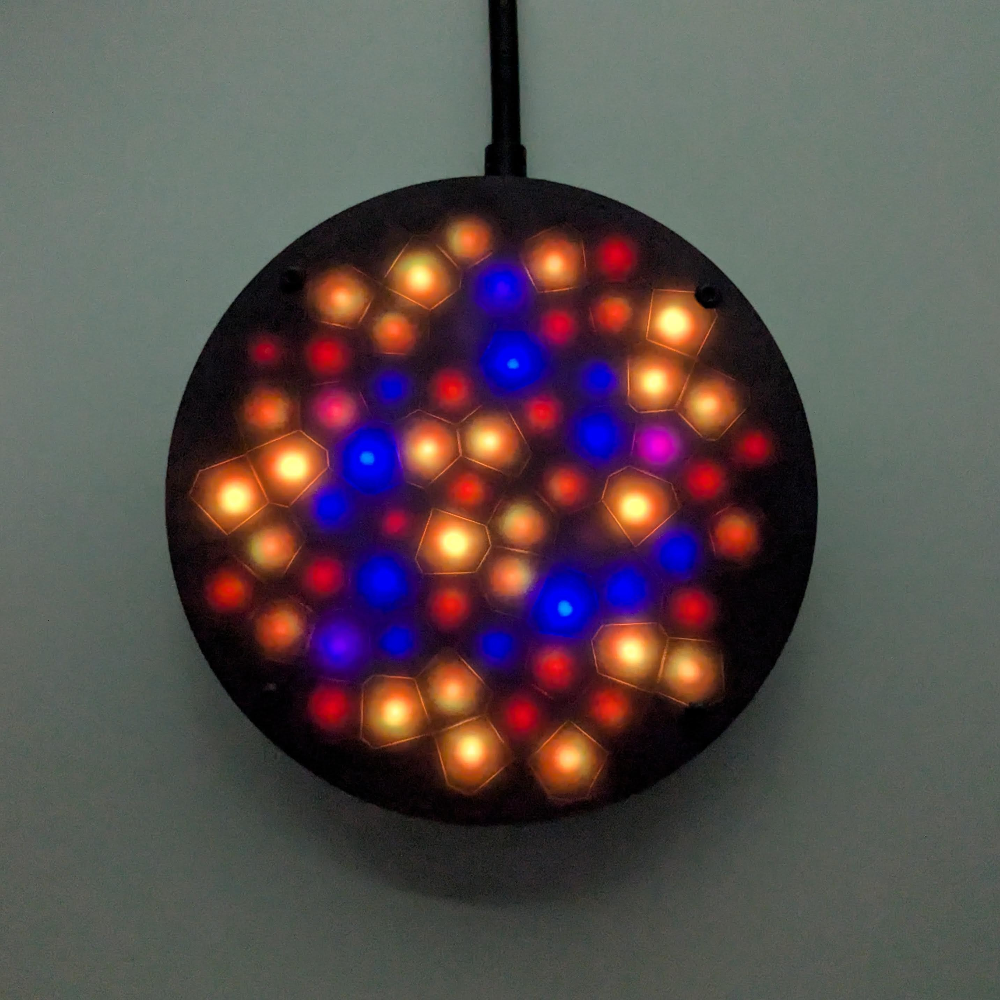

# Fibonacci64 Touch Demo

Demo Arduino firmware for 86mm Fibonacci64 WS2812 with touch pads

Available for purchase on Lectronz here: [https://lectronz.com/products/fibonacci64-86mm-rgb](https://lectronz.com/products/fibonacci64-86mm-rgb)

### Dependencies

I developed and tested this sketch with the following board and library versions. The sketch may work with other versions, but these are known to work.

Board: Adafruit QT Py (SAMD21) 
* Adafruit SAMD Boards version 1.7.5
* https://adafruit.github.io/arduino-board-index/package_adafruit_index.json

Libraries:
* FastLED v3.5.0: https://github.com/FastLED/FastLED
* Adafruit FreeTouch Library v1.1.1: https://github.com/adafruit/Adafruit_FreeTouch
* Button v1.0.0: https://github.com/madleech/Button